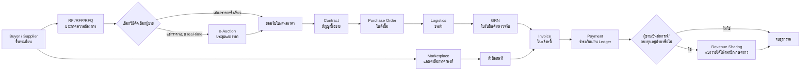

# AgroLink B2B Commerce Engine — Architecture

**สถานะเอกสาร:** ฉบับที่ 2 — แก้ไข 2026-08-16 (ดึก): ขั้น GRN/Invoice/Payment/Revenue
Sharing (ข้อ 4.8–4.11 ด้านล่าง, เดิมเป็นแค่ draft schema) **สร้างและทดสอบจริงแล้ว**
ในรอบนี้ (เรียกรวมว่า "Phase 3" ใน `backend/README.md` — ครอบคลุมทั้ง Phase 4
"GRN+Invoice+Payment" และ Phase 5 "Revenue Sharing" ในตาราง Roadmap ข้อ 7 เดิม
พร้อมกันในรอบเดียว) schema จริงต่างจาก draft เดิมเล็กน้อย โดยเฉพาะที่มาของ `lot_id`
สำหรับ Revenue Sharing (ดูหมายเหตุแก้ไขในข้อ 4.11) — ดูสถานะล่าสุดที่ตาราง Roadmap
ข้อ 7 และ `backend/README.md` หัวข้อ "AgroLink B2B Commerce Engine — Phase 3"
สำหรับรายละเอียดที่ทดสอบจริงทั้งหมด. ฉบับที่ 1 (2026-08-16 เช้า) คือเนื้อหาเดิมด้านล่างนี้
ที่ยังไม่แก้ไข
**ผู้ร้องขอ:** วิสัยทัศน์ "AgroLink ไม่ควรหยุดอยู่ที่ Procurement Software แต่ควรเป็น Agri B2B Commerce & Transaction Infrastructure"

## 1. หลักการออกแบบ

1. **ต่อยอดของเดิม ไม่สร้างซ้ำ.** ก่อนออกแบบตารางใหม่ทุกครั้ง เอกสารนี้สำรวจ schema ที่มีอยู่แล้วก่อน (`02_full_schema.sql`) — ผลสำรวจพบว่า AgroLink มีโครงสร้างพื้นฐานระดับ enterprise อยู่แล้วสำหรับ 3 ใน 11 ขั้นตอน (Contract, Logistics, Payment engine) เพียงแต่ยังไม่มีกลไกเชื่อมต่อ (orchestration) ระหว่างขั้นตอนให้ไหลต่อกันเป็น pipeline เดียว
2. **Subject/Actor model เดิมใช้ได้ทั้งหมด.** `identity.organization.org_type` มีอยู่แล้ว: `Cooperative` (สหกรณ์), `VillageFund` (กองทุนหมู่บ้าน), `Mill` (โรงสี), `Buyer` (ผู้รับซื้อ — ครอบคลุมโรงงานอาหารสัตว์ในฐานะผู้ซื้อวัตถุดิบ), `InputSupplier`, `Logistics`, `Lender`, และกลุ่ม Service Provider (`TractorService`/`DroneService`/`HarvesterService`/`TruckService`/`DryingYardService`) — ไม่ต้องเพิ่ม org_type ใหม่สำหรับผู้เล่นที่ผู้ใช้ระบุมา ยกเว้น "โรงงานอาหารสัตว์" ที่ยังไม่มี org_type เฉพาะ (ใช้ `Buyer` หรือ `Mill` แทนได้ในเบื้องต้น — ดูข้อ 9)
3. **"No row-level security, explicit WHERE clause IS the security boundary"** — ทุกตารางใหม่ในเอกสารนี้ตามธรรมเนียมเดียวกับ `marketplace.*`/`procurement.*` เดิม (ดูหมายเหตุใน `machinery.js`/`procurement.js`)
4. **Ledger เป็นจุดเดียวที่อนุญาตให้เงินเคลื่อนไหว.** `ledger.transfer_funds()` ที่มีอยู่แล้ว (double-entry, deadlock-safe, balance-checked) คือ "Payment Engine" ของทั้งระบบอยู่แล้ว — ทุกขั้นตอนที่เกี่ยวกับเงิน (Payment, Revenue Sharing) เรียกผ่านฟังก์ชันนี้เท่านั้น ไม่มีการ INSERT ตรงเข้า `ledger.journal_*`
5. **"Manual today, real integration later" honesty pattern** สืบทอดจากฟีเจอร์ RFQ — ทุกจุดที่ยังไม่ auto-wire จะระบุไว้ชัดเจนในเอกสารนี้และใน `backend/README.md`

## 2. ภาพรวม Pipeline (Workflow จริง)



**หมายเหตุ:** เส้น "Marketplace → สั่งซื้อทันที → Invoice" คือเส้นทางสั้นที่มีอยู่แล้ว (`marketplace.product_order`) สำหรับการซื้อขายราคาคงที่ที่ไม่ต้องผ่าน RFQ/Auction/Contract/PO — ยังคงใช้งานได้ควบคู่กับเส้นทางยาวสำหรับดีลมูลค่าสูง/สั่งตัด

## 3. Actor ↔ Portal ↔ org_type mapping

| ผู้เล่นที่ผู้ใช้ระบุ | `org_type` / subject ที่มีอยู่ | พอร์ทัลปัจจุบัน | บทบาทใน Commerce Engine |
|---|---|---|---|
| สหกรณ์ | `Cooperative` | `frontend/coop/` | Requester (ซื้อปัจจัยการผลิต) + Responder (ขายผลผลิต/สินค้าแปรรูป) + **ตัวกลางกระจายรายได้ให้สมาชิก (Revenue Sharing)** |
| กองทุนหมู่บ้าน | `VillageFund` | *ยังไม่มีพอร์ทัล* | เช่นเดียวกับสหกรณ์ — Responder ที่ต้องกระจายรายได้ให้สมาชิก |
| เกษตรกร | `identity.farmer` | `frontend/` (top-level) | Requester (RFQ ปัจจัยการผลิต) + สมาชิกผู้รับส่วนแบ่งรายได้ (ไม่ใช่ responder โดยตรงในรอบนี้ — ตามดีไซน์เดิมของ RFQ) |
| โรงสี | `Mill` | *ยังไม่มีพอร์ทัล* | Buyer (ซื้อข้าวเปลือก) — ใช้เส้นทาง RFQ→Contract→PO เต็มรูปแบบเพราะปริมาณ/มูลค่าสูง |
| โรงงานอาหารสัตว์ | *ไม่มี org_type เฉพาะ — แนะนำใช้ `Buyer` ชั่วคราว* | `frontend/buyer/` | Buyer (ซื้อวัตถุดิบ/ผลพลอยได้) |
| Supplier (ปัจจัยการผลิต) | `InputSupplier` | `frontend/inputsupplier/` | Responder |
| Logistics | `Logistics` | *ยังไม่มีพอร์ทัล* | ผู้ให้บริการขนส่งใน `logistics.shipment` (มี schema แล้ว ยังไม่มี UI) |
| Service Provider | `TractorService`/`DroneService`/`HarvesterService`/`TruckService`/`DryingYardService` | `frontend/machinery/` | Responder สำหรับ RFQ ประเภท `machinery_service` |

## 4. แต่ละขั้นตอน — schema เดิม/ใหม่ + API + สถานะการสร้าง

### 4.1 Buyer/Supplier (ขึ้นทะเบียน) — ✅ มีอยู่แล้ว
`identity.organization` + `identity.organization_role` + `partner.vendor_profile` + `POST /auth/org-register`, `POST /admin/organizations/:id/kyb-status` ไม่มีอะไรต้องเพิ่ม

### 4.2 Marketplace (ราคาคงที่) — ✅ มีอยู่แล้ว
`marketplace.product_listing`/`product_order`/`service_listing` — เส้นทางลัดสำหรับดีลมูลค่าต่ำ ไม่ผ่าน RFQ/Contract

### 4.3 RFI/RFP/RFQ — ✅ มีอยู่แล้ว (สร้างเสร็จรอบที่แล้ว)
`procurement.rfq`/`rfq_quote`, `backend/src/routes/procurement.js`, UI ใน Cooperative/Buyer/InputSupplier/Farmer

**ส่วนที่ยังไม่มี:** RFI (Request for Information — ขอข้อมูลเบื้องต้นแบบไม่ผูกมัดราคา) เป็น sub-type ที่ยังไม่แยกจาก RFQ — แนะนำให้เพิ่ม `rfq.request_type IN ('RFI','RFP','RFQ')` ในรอบถัดไปแทนการสร้างตารางใหม่ (RFI ต่างจาก RFQ แค่ "ไม่บังคับราคา" เท่านั้น โครงสร้างข้อมูลเหมือนกันทุกอย่าง)

### 4.4 e-Auction — 🆕 สร้างในรอบนี้
**ตารางใหม่:** `procurement.auction`, `procurement.auction_bid` (ดูรายละเอียด SQL ใน `backend/db/grant_b2b_commerce_engine.sql`)

- Auction หนึ่งรายการผูกกับ RFQ หนึ่งรายการเสมอ (`rfq_id` FK) — ไม่สร้าง requester/category ซ้ำ ใช้ของ RFQ เดิม
- โหมด `reverse` (ผู้ซื้อประกาศ ผู้ขายแข่งกันเสนอราคาต่ำสุดชนะ) เท่านั้นในรอบนี้ — ตรงกับ 90% ของ use case จัดซื้อ (ปัจจัยการผลิต/บริการเครื่องจักรกล) โหมด `forward` (ขายผลผลิตให้ผู้ซื้อแข่งราคาสูงสุด) เป็น roadmap เพราะ logic เหมือนกันแค่กลับทิศทาง sort
- Bid ใหม่ต้องต่ำกว่า bid ต่ำสุดปัจจุบัน (`current_lowest_bid`) มิฉะนั้น reject ด้วย `409 bid_not_competitive` — ป้องกันการประมูลที่ไม่มีความหมาย
- ปิดประมูลได้ 2 ทาง: ถึงเวลา `closes_at` (ตรวจสอบ lazy ตอน query, ไม่ใช้ cron) หรือ requester กดปิดเอง (`POST /auctions/:id/close`) — ผู้ชนะคือ bid ต่ำสุด ณ เวลาปิด
- ปิดประมูลแล้ว **auto-award ทันที** (ต่างจาก RFQ ที่ต้อง accept quote เอง) เพราะ auction คือกลไกที่ผลการแข่งขันเป็นตัวตัดสินอยู่แล้ว ไม่ต้องให้มนุษย์เลือกซ้ำ

**API (`/procurement/auctions*`):**
- `POST /procurement/auctions` — สร้าง auction จาก RFQ ของตัวเอง (requester เท่านั้น, RFQ ต้องยัง `open`)
- `GET /procurement/auctions?status=` — เรียกดู auction ที่เปิดอยู่ (ทุก subject ที่ผ่าน KYB)
- `GET /procurement/auctions/:id` — รายละเอียด + อันดับราคาปัจจุบัน (ไม่เปิดเผยชื่อผู้เสนอราคารายอื่นระหว่างประมูล — sealed-bid-lite)
- `POST /procurement/auctions/:id/bids` — วางราคา (organization เท่านั้น)
- `POST /procurement/auctions/:id/close` — ปิดและตัดสินผู้ชนะ (requester เท่านั้น หรือระบบปิดอัตโนมัติเมื่อพ้นเวลา)

### 4.5 Contract — 🆕 auto-generation เชื่อมกับของเดิม
**ไม่สร้างตารางใหม่** — `contract.contract`/`contract_party` มีอยู่แล้วและออกแบบมารองรับกรณีนี้ตั้งแต่แรก (`contract_type IN ('forward_purchase','service_agreement','input_supply_agreement', 'loan_agreement')`, มี `agreed_quantity`/`agreed_unit_price`/`quantity_unit`)

**สิ่งที่เพิ่ม:** ฟังก์ชัน `procurement.create_contract_from_rfq_award(p_rfq_id, p_quote_id)` — เรียกอัตโนมัติจาก `POST /rfqs/:id/quotes/:quoteId/accept` และ `POST /auctions/:id/close` เมื่อมีผู้ชนะ:
1. map `rfq.category` → `contract.contract_type` (`input_product`→`input_supply_agreement`, `produce`/`processed_good`→`forward_purchase`, `machinery_service`→`service_agreement`, `other`→`forward_purchase` เป็นค่า default)
2. INSERT `contract.contract` (`status='draft'`, `agreed_quantity`/`agreed_unit_price` จาก RFQ/quote ที่ชนะ)
3. INSERT `contract.contract_party` x2 (requester กับ responder, map `subject_type`/`org_type` → `party_role`)
4. เก็บ `contract_id` กลับไว้ที่ `procurement.rfq.contract_id` (คอลัมน์ใหม่) เพื่อ traceability

**ที่ยังไม่ทำอัตโนมัติ:** การเปลี่ยนสถานะ `draft`→`pending_signature`→`active` และการเซ็นชื่อดิจิทัล (`contract.digital_signature`) ยังต้องทำผ่าน endpoint เดิมที่มีอยู่แล้ว (ถ้ามี) หรือเป็น manual step — ไม่ auto-activate เพราะสัญญาต้องผ่านการยืนยันจากทั้งสองฝ่ายจริง

### 4.6 Purchase Order (PO) — 🆕 สร้างในรอบนี้
**ตารางใหม่:** `procurement.purchase_order` — ผูกกับ `contract_id` (สัญญาต้อง `active` ก่อนออก PO ได้)

- เลขที่ PO อัตโนมัติ รูปแบบ `PO-YYYYMMDD-XXXXXX` (สุ่ม 6 หลัก ไม่ใช้ sequence เพื่อเลี่ยง information leak เรื่องปริมาณ PO ทั้งระบบ)
- สถานะ: `issued` → `acknowledged` (ผู้ขายรับทราบ) → `in_fulfillment` → `completed` / `cancelled`
- หนึ่งสัญญาออก PO ได้หลายใบ (รองรับการส่งมอบเป็นงวด) — ผลรวมปริมาณใน PO ทั้งหมดของสัญญาเดียวกันไม่ควรเกิน `agreed_quantity` (ตรวจสอบระดับ application, เหมือนรูปแบบ `marketplace.product_order` เดิม)

**API (`/procurement/purchase-orders*`):**
- `POST /procurement/purchase-orders` — ออก PO จากสัญญาที่ active (buyer/requester)
- `GET /procurement/purchase-orders/mine` — PO ที่ตัวเองเป็นคู่สัญญา (ทั้งฝั่งออกและฝั่งรับ)
- `POST /procurement/purchase-orders/:id/acknowledge` — ผู้ขายรับทราบ PO
- `POST /procurement/purchase-orders/:id/cancel` — ยกเลิก (ทั้งสองฝ่ายก่อน `in_fulfillment`)

### 4.7 Logistics — ✅ มี schema อยู่แล้ว เชื่อมต่อในรอบถัดไป
`logistics.carrier`/`vehicle`/`shipment`/`shipment_item`/`proof_of_delivery`/`shipment_exception` (จาก `grant_cooperative_logistics.sql`) — ปัจจุบันผูกกับล็อตของสหกรณ์เท่านั้น (`grant_cooperative_logistics.sql`) **สิ่งที่ต้องทำในรอบถัดไป:** เพิ่ม `shipment.reference_type/reference_id` ให้ผูกกับ `purchase_order_id` ได้ด้วย (ไม่ใช่แค่ล็อตสหกรณ์) — เป็นการขยาย ไม่ใช่สร้างใหม่

### 4.8 GRN (ใบรับสินค้า/ตรวจรับ) — ✅ สร้างและทดสอบจริงแล้ว (2026-08-16 ดึก)
**ตารางจริง:** `procurement.goods_receipt` (schema จริงตรงกับ draft เดิมทุกคอลัมน์
ที่ระบุไว้ด้านล่าง) — ผู้ที่ **ออก PO เอง** (`PO_ISSUER_ROLES = ['farmer','buyer']`)
เป็นผู้บันทึก GRN ยืนยันว่าได้รับสินค้าจริง พร้อมปริมาณ/เหตุผลที่ปฏิเสธ (ถ้ามี) —
หนึ่ง PO บันทึก GRN ได้ครั้งเดียวเท่านั้น (`uq_grn_po`, บังคับด้วยทั้ง DB constraint
และ status guard ที่ backend: บันทึก GRN สำเร็จจะเปลี่ยนสถานะ PO เป็น
`in_fulfillment` ทันที ทำให้ความพยายามบันทึกซ้ำถูกบล็อกด้วย `409
po_not_acknowledged` ตั้งแต่ก่อนถึง DB constraint)

```sql
CREATE TABLE procurement.goods_receipt (
  grn_id              uuid PRIMARY KEY DEFAULT uuid_generate_v4(),
  po_id                uuid NOT NULL REFERENCES procurement.purchase_order(po_id),
  received_quantity    numeric(14,2) NOT NULL,
  accepted_quantity    numeric(14,2) NOT NULL,
  rejected_quantity    numeric(14,2) NOT NULL DEFAULT 0,
  rejection_reason     text,
  received_by_subject_type text NOT NULL,
  received_by_subject_id   uuid NOT NULL,
  received_at          timestamptz NOT NULL DEFAULT now(),
  CONSTRAINT grn_quantity_check CHECK (accepted_quantity + rejected_quantity <= received_quantity)
);
```

**API:** `POST /procurement/goods-receipts`, `GET /procurement/goods-receipts/mine`

### 4.9 Invoice — ✅ สร้างและทดสอบจริงแล้ว (2026-08-16 ดึก)
```sql
CREATE TABLE procurement.invoice (
  invoice_id      uuid PRIMARY KEY DEFAULT uuid_generate_v4(),
  po_id            uuid NOT NULL REFERENCES procurement.purchase_order(po_id),
  grn_id            uuid REFERENCES procurement.goods_receipt(grn_id),
  invoice_no        text NOT NULL UNIQUE,
  amount            numeric(18,2) NOT NULL,
  status            text NOT NULL DEFAULT 'issued', -- issued|paid|disputed|cancelled
  due_date          date,
  issued_at         timestamptz NOT NULL DEFAULT now(),
  paid_entry_id     uuid -- ledger.journal_entry.entry_id หลังชำระ
);
```
ฝั่ง**ผู้ขาย** (คู่สัญญาที่ไม่ใช่ผู้ออก PO) เป็นผู้ออกใบแจ้งหนี้ได้ ก็ต่อเมื่อมี GRN ที่
`accepted_quantity > 0` แล้วเท่านั้น — จำนวนเงินคำนวณอัตโนมัติจาก
`grn.accepted_quantity * po.unit_price` ไม่ให้กรอกมือ เชื่อมกับขั้น Payment ผ่าน
ฟังก์ชันจริง `procurement.pay_invoice(p_invoice_id, p_payer_subject_type,
p_payer_subject_id, p_payer_unit_id)` ที่เขียนตามแพทเทิร์นเดียวกับ
`produce.settle_delivery()`/`marketplace.complete_service_request()` ทุกประการ
(lock แถว → เรียก `ledger.transfer_funds()` → อัปเดตสถานะเป็น `paid` → ถ้า PO
ทั้งหมดของสัญญาถูกรับครบ 100% ของ `agreed_quantity` แล้ว เปลี่ยนสถานะสัญญาเป็น
`completed` อัตโนมัติด้วย) — `p_payer_unit_id` **บังคับ** เมื่อผู้จ่ายเป็นเกษตรกร
(หักจาก `ledger.account` ประเภท `unit_wallet` ของหน่วยผลิตนั้น ไม่ใช่บัญชีกลางของ
เกษตรกร) มิฉะนั้น `409` พร้อมข้อความอธิบายชัดเจน. รองรับ `POST
/invoices/:id/dispute` (ค้างในสถานะ `disputed`, ยังไม่มี workflow แก้ข้อพิพาทต่อ —
ดู "ยังไม่ทำ" ด้านล่าง) และ `POST /invoices/:id/cancel` (ก่อนชำระเท่านั้น)

**API:** `POST /procurement/invoices`, `GET /procurement/invoices/mine`,
`POST /procurement/invoices/:id/pay`, `POST /procurement/invoices/:id/dispute`,
`POST /procurement/invoices/:id/cancel`

### 4.10 Payment — ✅ engine มีอยู่แล้ว (`ledger.*`) — ต่อสายกับ Invoice เสร็จแล้ว
ไม่ต้องสร้างอะไรใหม่ในฝั่งบัญชี — `ledger.account`/`journal_entry`/`journal_line`/`transfer_funds()` คือ double-entry accounting engine ที่ใช้งานจริงอยู่แล้วกับ Lender/Buyer/Cooperative — `pay_invoice()` (ข้อ 4.9) เรียกมันแบบเดียวกับ `settle_delivery()` และผ่านการทดสอบจริงแล้วทั้ง 3 เส้นทาง (ผู้ซื้อองค์กรจ่ายตรงจากใบเสนอราคา, ผ่านการประมูล e-Auction, และเกษตรกรจ่ายจาก `unit_wallet`)

### 4.11 Revenue Sharing — ✅ สร้างและทดสอบจริงแล้ว (2026-08-16 ดึก)
กรณีผู้ขายที่ได้รับเงินคือ **สหกรณ์/กองทุนหมู่บ้าน** (ไม่ใช่บริษัทเอกชน) เงินที่เข้าบัญชี `vendor_settlement` ของสหกรณ์ต้องถูกกระจายต่อให้สมาชิกเกษตรกรตามสัดส่วนที่ตกลงกัน (เช่น ตามปริมาณผลผลิตที่แต่ละคนส่งมอบเข้าล็อตที่ขาย)

```sql
CREATE TABLE procurement.revenue_share_plan (
  plan_id       uuid PRIMARY KEY DEFAULT uuid_generate_v4(),
  invoice_id     uuid NOT NULL REFERENCES procurement.invoice(invoice_id),
  coop_org_id     uuid NOT NULL REFERENCES identity.organization(org_id),
  status          text NOT NULL DEFAULT 'pending', -- pending|distributed
  created_at      timestamptz NOT NULL DEFAULT now()
);

CREATE TABLE procurement.revenue_share_line (
  line_id        uuid PRIMARY KEY DEFAULT uuid_generate_v4(),
  plan_id         uuid NOT NULL REFERENCES procurement.revenue_share_plan(plan_id) ON DELETE CASCADE,
  unit_id          uuid NOT NULL REFERENCES production.production_unit(unit_id),
  share_percent     numeric(5,2) NOT NULL, -- ผลรวมต้อง = 100 ต่อ plan (ตรวจใน application)
  amount             numeric(18,2) NOT NULL,
  status              text NOT NULL DEFAULT 'pending', -- pending|paid|failed
  transfer_entry_id   uuid, -- ledger.journal_entry.entry_id หลังโอนสำเร็จ
  failure_reason      text  -- เหตุผลถ้าโอนล้มเหลว (เช่น ไม่มี unit_wallet)
);
```

**แก้ไขจาก draft เดิม (สำคัญ, พบระหว่างออกแบบก่อนเริ่มพัฒนา):** draft ฉบับที่ 1 ผูก
`lot_id` ไว้กับตัว `procurement.rfq` โดยตรง (ฝั่งผู้ประกาศความต้องการ/requester) —
พบว่าเป็นจุดบกพร่องเชิงสถาปัตยกรรมก่อนเขียนโค้ดจริง เพราะ
`create_contract_from_award()` กำหนด role `'buyer'` ให้ผู้ประกาศ RFQ เสมอ และ
กำหนด role `'seller'` ให้ **ผู้ชนะการเสนอราคา/ประมูล** (สำหรับ category='produce')
ส่วน `pay_invoice()`/`create_revenue_share_plan()` ก็ resolve ผู้รับเงิน
(coop_org_id) จากฝ่าย `'seller'` เท่านั้น — ถ้าผูก `lot_id` ไว้ที่ RFQ (ฝั่งผู้ซื้อ)
เงินจะไหลไปหาใครก็ตามที่ชนะประมูล/ได้รับเลือก ไม่ใช่สหกรณ์เจ้าของล็อตที่ขายจริง
(เจ้าของล็อตตัวจริงอาจไม่ใช่ผู้ชนะเลยด้วยซ้ำถ้ามีคนอื่นมาเสนอราคาแข่ง) **แก้แล้ว:**
`lot_id` ย้ายไปอยู่ที่ `procurement.rfq_quote.lot_id` และ
`procurement.auction_bid.lot_id` แทน — คือฝั่ง**ผู้ขาย/ผู้เสนอราคาเอง**เลือกล็อต
ของตัวเองตอนเสนอราคา (บังคับว่า RFQ ต้องเป็น category='produce' และล็อตต้องเป็น
ของ org ที่เสนอราคาเท่านั้น มิฉะนั้น `403 lot_not_owned`) รับประกันว่าเงินไหลไปหา
เจ้าของล็อตตัวจริงเสมอไม่ว่าจะชนะผ่านเส้นทางไหน

**สัดส่วนคำนวณจากอะไร:** `create_revenue_share_plan(invoice_id)` resolve
`lot_id` จาก `rfq.awarded_quote_id → rfq_quote.lot_id` แล้วคำนวณสัดส่วนจาก
`produce.delivery` ที่มีอยู่แล้ว — `SUM(quantity_ton) GROUP BY unit_id FROM
produce.delivery WHERE lot_id = X AND status = 'settled'` หารด้วยปริมาณรวมทั้งล็อต
— ไม่ต้องให้เจ้าหน้าที่สหกรณ์กรอกสัดส่วนมือ ระบบคำนวณให้จากข้อมูลที่มีอยู่แล้วจริงในฐานข้อมูล
เรียกได้ก็ต่อเมื่อ `invoice.status = 'paid'` แล้วเท่านั้น

**ฟังก์ชันกระจายเงิน** `procurement.distribute_revenue_share(p_plan_id)` — วน loop
ทุกแถวสถานะ `pending` ใน `revenue_share_line` เรียก `ledger.transfer_funds()` จาก
บัญชี `vendor_settlement` ของสหกรณ์ ไปบัญชี `unit_wallet` ของหน่วยผลิตแต่ละราย
ทีละรายการ **ภายใน `BEGIN...EXCEPTION WHEN OTHERS...END` block ของตัวเอง**
(PL/pgSQL implicit savepoint) — ถ้ารายการหนึ่งล้มเหลว (เช่น เกษตรกรรายนั้นไม่มี
`unit_wallet` ยัง) จะถูกบันทึกเป็น `status='failed'` พร้อม `failure_reason` โดย
ไม่ทำให้รายการอื่นถูก rollback ไปด้วย

**API:** `POST /procurement/revenue-share-plans`, `GET
/procurement/revenue-share-plans/mine`, `POST
/procurement/revenue-share-plans/:id/distribute`

**ทดสอบจริงแล้ว 3 เส้นทาง E2E** (HTTP จริง + DB จริง, ไม่ใช่ unit test): (1)
ผู้ซื้อองค์กรยอมรับใบเสนอราคาสหกรณ์โดยตรง → PO → GRN → Invoice → จ่ายเงินจริง →
สร้างแผนกระจายรายได้ → กระจายเงินจริงให้ 2 หน่วยผลิตตามสัดส่วน 6/10 และ 4/10 ตัน;
(2) เส้นทางเดียวกันแต่ผ่าน e-Auction แทนการรับใบเสนอราคาตรง; (3) เกษตรกรเป็น
ผู้ออก PO ซื้อปัจจัยการผลิตเอง แล้วจ่ายเงินจาก `unit_wallet` ของตัวเอง (เส้นทางนี้ไม่มี
Revenue Sharing เพราะผู้ขายเป็น InputSupplier ไม่ใช่สหกรณ์) — ทุกเส้นทางตรวจสอบ
`ledger.journal_entry`/`journal_line` จริงว่ายอด debit/credit ถูกต้องครบถ้วน

## 5. ไฟล์ที่เกี่ยวข้อง (แผนที่)

| ไฟล์ | สถานะ |
|---|---|
| `backend/db/grant_rfq_marketplace.sql` | ✅ มีอยู่แล้ว |
| `backend/db/grant_b2b_commerce_engine.sql` | ✅ สร้างแล้ว (รอบก่อน) — auction, PO, contract-hook function |
| `backend/db/grant_b2b_commerce_engine_phase3.sql` | ✅ สร้างและรันจริงแล้ว (รอบนี้, 2026-08-16 ดึก) — GRN, Invoice, `pay_invoice()`, Revenue Sharing (ข้อ 4.8–4.11) |
| `backend/src/routes/procurement.js` | ✅ ขยายแล้ว — auction + PO + GRN + Invoice + Revenue Share endpoints ครบ + contract auto-create |
| `frontend/coop/`, `frontend/buyer/`, `frontend/inputsupplier/` | ✅ ขยายแล้ว — UI auction + PO + GRN + Invoice ทั้ง 3 พอร์ทัล (Revenue Sharing UI มีเฉพาะ `frontend/coop/` เพราะมีแต่สหกรณ์ที่ต้องกระจายเงินคืนสมาชิก) |
| Logistics↔PO linking | 📋 ออกแบบในเอกสารนี้ (ข้อ 4.7) — รอบถัดไป |
| RFI เป็น request_type ของ RFQ | 📋 ออกแบบในเอกสารนี้ (ข้อ 4.3) — รอบถัดไป |
| พอร์ทัล Mill / VillageFund / Logistics | 📋 org_type มีอยู่แล้วในฐานข้อมูล ยังไม่มี frontend — รอบถัดไป |
| Auction+PO+GRN+Invoice UI บน Lender/Machinery/MarketVenue/FertilizerMixingService/Admin/Gov | 📋 backend รองรับ JWT องค์กรทุกประเภทอยู่แล้ว เหลือแค่ UI — รอบถัดไป |
| Dispute-resolution workflow สำหรับ Invoice `disputed` | 📋 `POST /invoices/:id/dispute` มีแล้ว แต่ยังไม่มีขั้นตอนแก้ไขข้อพิพาทต่อ (เช่น เจรจาใหม่/ยกเลิก/แก้จำนวนเงิน) — ค้างในสถานะ `disputed` เฉยๆ — รอบถัดไป |

## 6. Credit Score / Fintech / Data-AI (ที่ผู้ใช้กล่าวถึงว่าควรเชื่อมต่อ)

ระบบมี `credit` schema (credit scoring) และ `underwriting`/`risk` (สินเชื่อ) อยู่แล้วจากฟีเจอร์ Lender Portal เดิม — จุดเชื่อมต่อตามธรรมชาติกับ Commerce Engine คือ: **Contract ที่ active + ประวัติ PO/Invoice ที่ชำระตรงเวลา ควรเป็น input ใหม่ให้ credit scoring model** (payment behavior บนแพลตฟอร์มจริง แม่นยำกว่าข้อมูลนอกระบบ) — เป็นข้อเสนอ roadmap ระยะถัดไป ไม่ได้ออกแบบ schema ในเอกสารนี้เพราะต้องดูโมเดล credit scoring เดิมก่อนว่ารับ input เพิ่มแบบไหนได้

## 7. Roadmap สรุป

| Phase | ขอบเขต | สถานะ |
|---|---|---|
| 0 | Marketplace (ราคาคงที่) | ✅ เสร็จแล้ว (ก่อนหน้านี้) |
| 1 | RFI/RFP/RFQ | ✅ เสร็จแล้ว |
| 2 | e-Auction + Contract auto-gen + PO | ✅ เสร็จแล้ว |
| 3 | Logistics↔PO linking (ต่อของเดิม) | 📋 ถัดไป |
| 4 | GRN + Invoice + Payment-hook | ✅ เสร็จแล้ว (2026-08-16 ดึก, เรียกรวมกับ Phase 5 ว่า "Phase 3" ใน `backend/README.md`) |
| 5 | Revenue Sharing (สหกรณ์/กองทุนหมู่บ้าน) | ✅ เสร็จแล้ว (2026-08-16 ดึก, พร้อม Phase 4 ในรอบเดียวกัน) |
| 6 | พอร์ทัล Mill / VillageFund / Logistics (ปัจจุบันมีแต่ backend รองรับ org_type ยังไม่มีหน้าจอ) | 📋 ถัดไป |
| 7 | RFI แยกจาก RFQ, Credit Score integration | 📋 ถัดไป |
| 8 | Auction+PO+GRN+Invoice UI บนพอร์ทัลที่เหลือ (Lender/Machinery/MarketVenue/FertilizerMixingService/Admin/Gov) + dispute-resolution workflow | 📋 ถัดไป |
