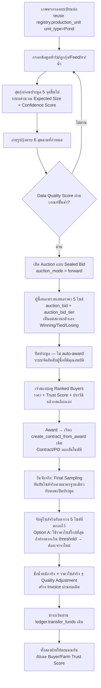

# AgroLink Shrimp Auction (Auction Place — ตลาดประมูลกุ้งสดแบบ Sealed Bid) — สถาปัตยกรรม

**สถานะเอกสาร:** ข้อเสนอสถาปัตยกรรม — **ยังไม่ได้เริ่มเขียนโค้ดจริง** เอกสารนี้แปลงข้อกำหนดทั้งหมดจากไฟล์ "AgroLink Shrimp Auction.docx" ที่แนบมา (56 หัวข้อ) ให้เข้ากับโครงสร้างเดิมของระบบ AgroLink ให้มากที่สุด ก่อนเริ่มลงมือสร้างจริง — เหมือนขั้นตอนที่ทำกับ Group Buy ก่อนหน้านี้

---

## 1. หลักการออกแบบ

1. **นี่คือ "การประมูลแบบเสนอราคาขึ้น" (forward auction) ซึ่งเป็นของใหม่ต่อระบบ.** e-Auction เดิมที่มีอยู่ (`procurement.auction`/`auction_bid`) เป็น **reverse auction** เท่านั้น — ผู้ซื้อประกาศความต้องการ ผู้ขายแข่งกันเสนอราคา**ลง** ปิดแล้วราคาต่ำสุดชนะอัตโนมัติ ตรงข้ามกับกุ้งที่เจ้าของบ่อ (ผู้ขาย) ประกาศของที่มี ผู้ซื้อหลายรายแข่งกันเสนอราคา**ขึ้น** — โค้ดเดิมมีคอมเมนต์ระบุไว้ตรงๆ ว่า forward mode เป็น "documented future widening, not built now" เอกสารนี้จึงเป็นจุดที่ต้องเพิ่มจริง ไม่ใช่แค่ configuration
2. **ปิดประมูลแล้วไม่ auto-award — เจ้าของบ่อเลือกเอง.** ตามข้อ 24-25 ของเอกสารต้นฉบับ ("Highest Qualified Bid + Farmer Choice") ระบบมีหน้าที่จัดอันดับผู้ซื้อที่เสนอราคาสูงสุด/มีคุณสมบัติผ่านเกณฑ์ แต่**การเลือกผู้ชนะเป็นการกดเลือกของเจ้าของบ่อเสมอ** ต่างจาก e-Auction เดิมที่ auto-award ทันทีเมื่อปิด
3. **ราคาที่ประมูลได้ ≠ ราคาที่จ่ายจริง.** ราคาที่ตกลงกันตอนประมูลคือ "ราคาต่อไซส์" (bid matrix 5 ไซส์) ส่วนราคาที่ใช้ชำระเงินจริงมาจาก **Final Sampling วันจับจริง** จับคู่กับไซส์ในตารางที่ตกลงไว้ล่วงหน้า — settlement จึงต้องเป็นขั้นตอนแยกหลัง Award ไม่ใช่ตอนปิดประมูล
4. **ต่อยอดของเดิมให้มากที่สุด ไม่สร้างระบบคู่ขนาน.**
   - บ่อกุ้ง → reuse `registry.production_unit` (`unit_type` มี `'Pond'` อยู่แล้ว ไม่ต้องแก้ schema จุดนี้)
   - รูปภาพ → reuse `storage.file_object` เดิม (เพิ่มตารางเชื่อมสำหรับ role/GPS ที่ยังไม่มี)
   - ผู้ซื้อ → reuse role `'Buyer'` เดิมใน `identity.organization_role` (`backend/src/routes/buyer.js`)
   - Contract/PO/GRN/Invoice/Payment → reuse `procurement.create_contract_from_award()` และท่อเดิมทั้งหมดหลัง Award ไม่แก้โค้ดส่วนนี้เลย
   - สิ่งที่ยังไม่มีเลยในระบบและต้องสร้างใหม่จริงๆ: schema `aquaculture.*` (ข้อมูลฟาร์ม/บ่อ/อาหาร/ยา/น้ำ/สุ่มตัวอย่าง/เรตติ้งผู้ซื้อ-ฟาร์ม) + คอลัมน์/ตารางขยายเล็กๆ ใน `procurement` (โหมดประมูล + ตารางราคาหลายไซส์)
5. **"Manual today, real integration later" เหมือนเดิม.** AI ตรวจภาพกุ้ง (ข้อ 8), Price Benchmark (ข้อ 52.1), Escrow (ข้อ 34), Digital Shrimp Passport (ข้อ 52.5), Automated Buyer Matching — ทั้งหมดนี้เอกสารต้นฉบับเองจัดเป็น Phase 2/3 อยู่แล้ว (ข้อ 55) เอกสารนี้ตามคำแนะนำเดิมทุกจุด ไม่เพิ่มเอง
6. **เจ้าของบ่อ = เกษตรกรรายบุคคล (`identity.farmer`) เสมอ** ตามคำที่เอกสารต้นฉบับใช้ตลอดทั้งฉบับ ("เจ้าของบ่อ") ไม่ใช่สหกรณ์/องค์กร — ถ้าต้องการให้สหกรณ์ลงประกาศแทนสมาชิกที่เลี้ยงกุ้ง เป็นส่วนขยาย Phase ถัดไป ไม่ใช่ Phase 1

---

## 2. ภาพรวม Flow



**หมายเหตุ:** กรอบ J เป็นจุดต่อกลับเข้าท่อ Contract→PO→GRN→Invoice→Payment **เดิมของระบบทั้งหมด ไม่มีการแก้โค้ดส่วนนี้** — เหมือนหลักการเดียวกับ Group Buy

---

## 3. Schema ใหม่ที่เสนอ (schema ใหม่ชื่อ `aquaculture` + ส่วนขยายเล็กใน `procurement`)

### 3.1 บ่อกุ้ง — ไม่มีตารางใหม่
ใช้ `registry.production_unit` เดิม (`unit_type='Pond'`) ผ่าน `registry.register_production_unit()` เดิม ไม่แก้อะไร

### 3.2 `aquaculture.farm_profile`
ข้อมูลระดับฟาร์มที่ `identity.farmer` ยังไม่มีคอลัมน์รองรับ (ชื่อฟาร์ม/จังหวัด/อำเภอ/จำนวนบ่อ/ระบบเลี้ยง)

| คอลัมน์ | ชนิด | หมายเหตุ |
|---|---|---|
| `farm_profile_id` | uuid PK | |
| `farmer_id` | uuid FK → `identity.farmer`, UNIQUE | หนึ่งเกษตรกรหนึ่งโปรไฟล์ฟาร์ม |
| `farm_name`, `province`, `district` | text | `identity.farmer.region_code` เดิมหยาบกว่านี้ ไม่พอสำหรับแสดงในหน้าประมูล |
| `pond_count`, `farming_system`, `farming_history_note` | int / text | ระบบเลี้ยง เช่น กึ่งพัฒนา/พัฒนา, ประวัติการเลี้ยงแบบข้อความอิสระ |
| `created_at` / `updated_at` | timestamptz | |

### 3.3 `aquaculture.pond_detail`
ข้อมูลจำเพาะของบ่อ+รอบเลี้ยงปัจจุบัน ผูก 1:1 กับ `production_unit`

| คอลัมน์ | ชนิด | หมายเหตุ |
|---|---|---|
| `unit_id` | uuid PK, FK → `registry.production_unit` | |
| `water_volume_est_m3`, `pond_prep_date` | numeric / date | |
| `species` | text CHECK IN (`'vannamei'`,`'black_tiger'`,`'other'`) | |
| `stocking_date`, `postlarvae_count`, `stocking_density`, `postlarvae_size`, `hatchery_name`, `postlarvae_lot`, `expected_survival_rate_pct` | ตามข้อ 5-6 ในเอกสาร | |
| `updated_at` | timestamptz | |

### 3.4 Log แบบ append-only (รูปแบบเดียวกับ `carbon.awd_water_log` ที่มีอยู่แล้ว)
สามตาราง โครงสร้างคล้ายกัน ไม่มี UPDATE/DELETE grant:
- `aquaculture.feed_log` (log_date, shrimp_age_days, feed_brand, feed_grade, feed_amount_kg, feeding_method, feedings_per_day, fcr)
- `aquaculture.medication_log` (log_date, product_name, amount, reason, recommended_by, withdrawal_period_days, category CHECK IN `'medicine'/'water_treatment'/'probiotic'/'mineral'/'other'`)
- `aquaculture.water_quality_log` (measured_at, ph, do_mg_l, salinity_ppt, temperature_c, ammonia_mg_l, nitrite_mg_l, alkalinity, measured_by, method_note)

ทั้งสามผูกกับ `unit_id FK production_unit` + denormalize `farmer_id` เหมือน `awd_water_log`

### 3.5 `aquaculture.sampling_event` + `aquaculture.sampling_point`
ใช้ตารางเดียวกันทั้งตอนก่อนประมูลและวันจับจริง แยกด้วย `purpose`

**`sampling_event`:** `sampling_id, unit_id FK, purpose CHECK IN ('pre_auction','final_harvest','third_party')`, `sampled_at`, `method_note`, `computed_size_per_kg numeric` (คำนวณจากผลรวมทุกจุด), `confidence_score CHECK IN ('High','Medium','Low')` (กฎ: ≥5 จุด และค่าการกระจายแคบ → High, ตามข้อ 15), `created_by_subject_id`, `created_at`

**`sampling_point`:** `point_id, sampling_id FK CASCADE, point_no, sample_count, sample_weight_kg` — บังคับที่ระดับ API ว่าต้อง**อย่างน้อย 5 จุด**ต่อหนึ่ง `sampling_event` (ตามข้อ 13-14) `size_per_kg` ต่อจุดคำนวณจาก `sample_count / sample_weight_kg`

### 3.6 `aquaculture.auction_photo`
เชื่อมกับ `storage.file_object` เดิม (ซึ่งไม่มี GPS/role) เพิ่มเฉพาะสิ่งที่ยังไม่มี:

| คอลัมน์ | ชนิด | หมายเหตุ |
|---|---|---|
| `photo_id` | uuid PK | |
| `file_id` | uuid FK → `storage.file_object` | |
| `unit_id` | uuid FK → `production_unit` | |
| `photo_role` | text CHECK IN (`'tray'`,`'closeup'`,`'shell_back'`,`'head_eye'`,`'tail'`,`'ruler_reference'`) | ตามข้อ 7 (6 มุมบังคับ) |
| `captured_at`, `gps_lat`, `gps_lng` | timestamptz / numeric | ฝั่ง client ส่งมาตอนถ่าย ระบบไม่ตรวจ EXIF จริง (ดูข้อ 8 หัวข้อสมมติฐาน) |

ก่อนเปิด auction ได้ ต้องมีครบทั้ง 6 `photo_role` สำหรับ `unit_id` นั้น (ตรวจที่ API ตอนเปลี่ยนสถานะเป็น `submitted`)

### 3.7 `aquaculture.quality_description`
`auction_id FK UNIQUE, shell_thickness, shell_hardness, color, has_spots, tail_condition, size_uniformity, has_soft_shell, dead_or_spoiled boolean, abnormal_smell boolean, additional_note` — ค่า enum ตามข้อ 9 ทั้งหมด

### 3.8 ส่วนขยาย `procurement.auction` (ALTER แบบ additive เท่านั้น เหมือนที่ `grant_sealed_bid_auction.sql` เคยทำกับ `bid_visibility`)
```sql
ALTER TABLE procurement.auction
  ADD COLUMN IF NOT EXISTS auction_mode text NOT NULL DEFAULT 'reverse'
    CHECK (auction_mode IN ('reverse', 'forward'));
```
`'reverse'` (ค่าเดิม) = ราคาต่ำสุดชนะ auto-award เหมือนเดิมทุกประการ ไม่กระทบ auction เก่าแม้แต่แถวเดียว `'forward'` (ใหม่) = ราคาสูงสุด/ผ่านเกณฑ์ชนะ **ไม่ auto-award** ปิดแล้วเปลี่ยนสถานะเป็น `pending_farmer_selection` แทน

### 3.9 ตารางราคาหลายไซส์
- **`aquaculture.auction_size_tier`**: `tier_id, rfq_id FK, tier_label` (`S-2/S-1/Target/S+1/S+2`), `size_per_kg_min`, `size_per_kg_max`, `display_order` — เจ้าของบ่อ/ระบบกำหนด 5 ไซส์รอบ Target ตอนสร้างประมูล (ข้อ 18-19)
- **`procurement.auction_bid_tier`**: `bid_tier_id, bid_id FK → procurement.auction_bid ON DELETE CASCADE, tier_id FK, price numeric NOT NULL CHECK (price > 0)` — ผู้ซื้อต้องกรอกราคาครบทั้ง 5 ไซส์ (บังคับที่ API ไม่รับ bid ที่กรอกไม่ครบ ตามข้อ 19)

### 3.10 `aquaculture.harvest_settlement`
| คอลัมน์ | ชนิด | หมายเหตุ |
|---|---|---|
| `settlement_id` | uuid PK | |
| `auction_id` | uuid FK UNIQUE | |
| `final_sampling_id` | uuid FK → `sampling_event` | |
| `actual_weight_kg` | numeric | น้ำหนักชั่งจริง |
| `matched_tier_id` | uuid FK → `auction_size_tier` | ไซส์ที่จับคู่ได้ตามกติกา Option A |
| `tier_price` | numeric | ราคาต่อไซส์ที่จับคู่ได้ |
| `quality_adjustment_pct` | numeric DEFAULT 0 | Premium/Discount ตามข้อ 31 |
| `final_amount` | numeric GENERATED ALWAYS AS (`actual_weight_kg * tier_price * (1 + quality_adjustment_pct/100)`) STORED | |
| `requires_renegotiation` | boolean DEFAULT false | true เมื่อไซส์จริงห่างเกิน threshold (ดูข้อ 8.1) |
| `created_at` | timestamptz | |

### 3.11 คะแนนความน่าเชื่อถือ
- `aquaculture.buyer_rating` (auction_id, farmer_id, buyer_org_id, payment_score int 1-5, pickup_score int 1-5, dispute boolean, note)
- `aquaculture.farmer_rating` (auction_id, buyer_org_id, farmer_id, accuracy_size_score, accuracy_weight_score, quality_accuracy_score, sampling_reliability_score, dispute boolean, note)
- `aquaculture.buyer_trust_score` / `farm_trust_score` — **view** (ไม่ใช่ ML) เฉลี่ยถ่วงน้ำหนักอย่างง่ายจาก rating ข้างต้น + จำนวนธุรกรรม สำหรับ Phase 1 เท่านั้น (ปัจจุบันระบบยังไม่มีคะแนนความน่าเชื่อถือของผู้ซื้อเลย ต้องสร้างใหม่ทั้งหมด — จุดนี้ต่างจาก Group Buy ที่ reuse ของเดิมได้)

### 3.12 `aquaculture.dispute`
`dispute_id, auction_id, raised_by_subject_type/id, reason, status CHECK IN ('open','third_party_sampling','resolved'), resolution_note, fee_charged_to_subject_type/id, created_at, resolved_at` — Phase 1 ให้ Platform Ops (admin) เป็นผู้บันทึกผล Third-Party Sampling แทน ไม่มีบัญชีบทบาท "ผู้ตรวจกลาง" แยกต่างหาก (ดูข้อ 8.5)

---

## 4. ฟังก์ชันสำคัญที่ต้องเขียน

| ฟังก์ชัน | หน้าที่ |
|---|---|
| `aquaculture.compute_data_quality_score(p_unit_id)` | คำนวณคะแนนตามน้ำหนักในเอกสารข้อ 42 (Sampling 25% / Photos 15% / Feed 15% / Stocking 10% / Water 10% / Medication 10% / Farm History 10% / Other 5%) — ใช้เป็นเงื่อนไขเปิด auction ได้หรือไม่ |
| `aquaculture.create_shrimp_award(p_auction_id, p_bid_id, p_selected_by_farmer_id)` | บันทึกการเลือกของเจ้าของบ่อ แล้วเรียก `procurement.create_contract_from_award()` **เดิม** ต่อ — จุดเชื่อมกลับเข้าท่อเดิม |
| `aquaculture.determine_settlement_price(p_auction_id, p_final_size_per_kg)` | จับคู่ไซส์จริงกับ `auction_size_tier`, คำนวณ Option A (ไซส์ใกล้ที่สุด) หรือตั้ง `requires_renegotiation=true` ตาม threshold |

---

## 5. API ที่เสนอ (ไฟล์ใหม่ `backend/src/routes/aquaculture.js`)

| Endpoint | ใครเรียก | ทำอะไร |
|---|---|---|
| `POST /aquaculture/farm-profile` | เกษตรกร | สร้าง/แก้ไขโปรไฟล์ฟาร์ม |
| `POST /aquaculture/ponds/:unitId/detail` | เกษตรกร | กรอกข้อมูลบ่อ+ลูกกุ้ง (ต้องเป็นเจ้าของ `production_unit` นั้น) |
| `POST /aquaculture/ponds/:unitId/feed-log` `/medication-log` `/water-quality-log` | เกษตรกร | บันทึก log แต่ละประเภท (append เท่านั้น) |
| `POST /aquaculture/ponds/:unitId/sampling` | เกษตรกร | บันทึกผลสุ่ม (`purpose='pre_auction'`) พร้อมจุดสุ่ม ≥5 จุด |
| `POST /aquaculture/ponds/:unitId/photos` | เกษตรกร | แนบรูป (เรียก `/storage/upload` เดิมก่อน แล้วผูก role/GPS ที่นี่) |
| `GET /aquaculture/ponds/:unitId/readiness` | เกษตรกร | เช็คว่าครบเงื่อนไขเปิด auction หรือยัง + คะแนน Data Quality |
| `POST /aquaculture/auctions` | เกษตรกร | เปิด auction จริง (สร้าง `rfq` + `auction(auction_mode='forward')` + 5 `auction_size_tier`) — ปฏิเสธถ้า Data Quality Score ต่ำกว่าเกณฑ์ |
| `GET /aquaculture/auctions?status=` | ทุกคน (Buyer เห็นเพื่อประมูล) | รายการ auction พร้อมสรุปบ่อ/ฟาร์ม/Confidence Score |
| `GET /aquaculture/auctions/:id` | ทุกคน | หน้ารายละเอียด 6 ส่วนตามข้อ 38 (Pond/Shrimp/Quality/Farming Data/Auction/Logistics) |
| `POST /aquaculture/auctions/:id/bids` | Buyer (Verified) | ส่งราคาครบ 5 ไซส์ (upsert) — คืนเฉพาะสถานะ 🟢🟡🔴 ต่อไซส์ ไม่เปิดเผยราคาคู่แข่ง |
| `GET /aquaculture/auctions/:id/ranked-buyers` | เจ้าของบ่อเท่านั้น | หลังปิดประมูล ดูอันดับผู้ซื้อ + Trust Score + ประวัติ เพื่อกดเลือก |
| `POST /aquaculture/auctions/:id/select-buyer` | เจ้าของบ่อ | เลือกผู้ชนะ (`aquaculture.create_shrimp_award`) |
| `POST /aquaculture/auctions/:id/final-sampling` | เกษตรกร (หรือ Buyer/Platform Ops ถ้าเป็น third-party) | บันทึกผลสุ่มวันจับจริง (`purpose='final_harvest'`) |
| `POST /aquaculture/auctions/:id/settle` | เกษตรกรหรือ Buyer | เรียก `determine_settlement_price` แล้วสร้าง Invoice ผ่านท่อเดิม |
| `POST /aquaculture/auctions/:id/rate` | ทั้งสองฝ่ายหลังจบดีล | ให้คะแนนอีกฝ่าย |
| `POST /aquaculture/auctions/:id/dispute` | ทั้งสองฝ่าย | เปิดข้อพิพาท (Platform Ops จัดการต่อในหน้าแอดมิน) |

---

## 6. UI ที่เสนอ

พอร์ทัลใหม่ `frontend/aquaculture/` (แยกจาก `frontend/coop/`, `frontend/buyer/` เดิม เพราะผู้ใช้และ flow ต่างกันชัดเจน):
- **ฝั่งเกษตรกร (`farmer-dashboard.html`):** ฟอร์มกรอกข้อมูลบ่อ/ลูกกุ้ง/feed/ยา/น้ำแบบเป็นขั้นตอน (wizard) → หน้าสุ่มกุ้ง → หน้าอัปโหลดรูป 6 มุม → ปุ่มเปิด auction (โชว์ readiness score ก่อนกด) → หน้า Ranked Buyers หลังปิดประมูล → หน้า Final Sampling วันจับจริง
- **ฝั่งผู้ซื้อ (`buyer-dashboard.html`):** รายการ auction ที่เปิดอยู่ + หน้ารายละเอียด 6 ส่วน (ข้อ 38) + ฟอร์มกรอกราคา 5 ช่อง + สถานะ 🟢🟡🔴 ต่อไซส์
- **หน้าอธิบายสาธารณะ:** `auction-place.html` ที่ root (สร้างแล้วพร้อมกับเอกสารนี้ — ดู task คู่ขนาน "ทำเมนู Auction Place")

---

## 7. State machine ของ Auction (ย่อจาก 17 สถานะในเอกสารข้อ 40 ให้เหลือเท่าที่จำเป็นสำหรับ Phase 1)

`draft` → `submitted` → `open` (ผ่าน Data Quality เกณฑ์แล้ว, รับ bid ได้) → `closed` (หมดเวลา) → `pending_farmer_selection` → `awarded` → `harvested_settled` (รวม Final Sampling + Settlement เป็นสถานะเดียวเพื่อไม่ให้ state มากเกินจำเป็น) → `completed` (ชำระเงินแล้ว + ให้คะแนนแล้ว) — และ `cancelled` / `disputed` แทรกได้จากเกือบทุกจุด

สถานะละเอียดกว่านี้ในเอกสารต้นฉบับ (Verification, Bidding แยกจาก Open, Weighing แยกจาก Harvesting ฯลฯ) รวมไว้เป็น sub-state ที่ track ผ่านตารางลูก (เช่น มี/ไม่มี `harvest_settlement` แถวคือ "จับจริงแล้วหรือยัง") แทนที่จะเพิ่ม CHECK ยาวเกินไปในคอลัมน์เดียว

---

## 8. ประเด็นที่ผมตัดสินใจแทน (สมมติฐานที่ระบุตรงๆ — ทักท้วง/แก้ได้ก่อนเริ่มสร้าง)

1. **Threshold ไซส์นอกช่วง (เอกสารข้อ 30):** กำหนด default = ถ้าไซส์จริงห่างจากไซส่ปลายสุดที่ตกลงไว้ (เช่น กำหนด 24-40 แล้วได้จริง 45) **ไม่เกิน 1 ไซส์นอกช่วง** ใช้ราคาไซส์ปลายอัตโนมัติ (Option A ตามที่เอกสารแนะนำ) ถ้าห่างเกินนั้นตั้ง `requires_renegotiation=true` ให้เจรจานอกระบบ — ตัวเลข "1 ไซส์" นี้ปรับได้ภายหลัง ไม่ใช่ hardcode ถาวร
2. **Payment Phase 1:** ตามที่เอกสารแนะนำเอง (ข้อ 34) = หลักฐานการโอน + Buyer Trust Score เท่านั้น ยังไม่มี Escrow — Escrow เป็น Phase 2
3. **จำนวนจุดสุ่มขั้นต่ำ = 5 จุด** ตามข้อ 14 บังคับที่ API
4. **เกณฑ์ Data Quality Score ขั้นต่ำก่อนเปิด auction = 60/100** — ตัวเลขที่ผมเลือกเอง (เอกสารต้นฉบับไม่ได้ระบุตัวเลข) ปรับได้ภายหลังผ่านหน้า config แบบเดียวกับเกณฑ์ AWD ที่มีอยู่แล้วในหน้าแอดมิน
5. **Independent Sampling Agent / Dispute (ข้อ 27, 45):** Phase 1 ให้บัญชี Platform Ops บันทึกผล third-party sampling แทน ยังไม่สร้างบทบาทผู้ใช้ใหม่ "ผู้ตรวจกลาง" แยกต่างหาก
6. **EXIF/GPS ของรูปภาพ (ข้อ 43):** เก็บ `captured_at`/`gps_lat`/`gps_lng` ตามที่ client (แอปเว็บ) ส่งมาเท่านั้น **ไม่ตรวจสอบย้อนกลับกับ EXIF จริงของไฟล์ภาพ** ในรอบแรก — เป็นระบบกึ่งเชื่อใจ (honor system) ที่มี "ประวัติของฟาร์ม" (ข้อ 44) เป็นกลไกป้องปรามระยะยาวแทน

---

## 9. Phase 1 (MVP) เทียบกับ Phase 2/3 — อิงตามที่เอกสารต้นฉบับข้อ 55 แนะนำเอง

| งาน | Phase 1 (MVP) | Phase 2 | Phase 3 |
|---|---|---|---|
| ลงทะเบียนฟาร์ม/สร้างบ่อ/กรอกข้อมูลกุ้ง | ✅ | | |
| Feed / Medication / Water Quality log | ✅ | | |
| สุ่มกุ้งก่อนประมูล + Confidence Score | ✅ | | |
| อัปโหลดรูป 6 มุม | ✅ (ไม่ตรวจ EXIF จริง) | เพิ่มการตรวจสอบ EXIF/anti-fraud เข้มขึ้น | AI ช่วยตรวจภาพ (Decision Support เท่านั้น) |
| เปิด Auction แบบ Sealed Bid + Bid Matrix 5 ไซส์ | ✅ | | |
| สถานะ Winning/Tied/Losing ระหว่างประมูล | ✅ | | |
| เจ้าของบ่อเลือกผู้ซื้อจาก Ranked list | ✅ | | |
| Final Sampling + Settlement ตามไซส์จริง | ✅ | | |
| Buyer/Farm Trust Score (คำนวณอย่างง่าย) | ✅ | ปรับเป็นโมเดลถ่วงน้ำหนักซับซ้อนขึ้น | |
| Payment: หลักฐานโอน + Trust Score | ✅ | AgroLink Escrow เต็มรูปแบบ | |
| Dispute: Platform Ops บันทึกแทน third-party | ✅ | บัญชีบทบาท "ผู้ตรวจกลาง" แยก | |
| Price Benchmark (ราคาย้อนหลัง) | ❌ | ✅ | |
| Recommended Bid (AI แนะนำราคา) | ❌ | | ✅ |
| Expected Revenue ก่อน/หลังประมูล | ❌ | ✅ (คำนวณง่ายจาก tier price × qty) | |
| Buyer Cost Calculator (Freight/Ice/ฯลฯ) | ❌ | ✅ | |
| Digital Shrimp Passport | ❌ | | ✅ |
| Demand Forecast / Auto Buyer Matching | ❌ | | ✅ |

---

## 10. ไฟล์ที่คาดว่าต้องสร้าง/แก้ (ประมาณการ — ยังไม่ได้ลงมือ รอคำยืนยันขอบเขตก่อน)

| ไฟล์ | การเปลี่ยนแปลง |
|---|---|
| `backend/db/grant_shrimp_auction.sql` (ใหม่) | schema `aquaculture` ทั้งหมด (ข้อ 3) + ALTER `procurement.auction` เพิ่ม `auction_mode` + `procurement.auction_bid_tier` + ฟังก์ชัน 3 ตัว (ข้อ 4) + GRANT |
| `backend/src/routes/aquaculture.js` (ใหม่) | endpoint ทั้งหมดในข้อ 5 |
| `backend/src/routes/procurement.js` | แก้ sealed-bid closing logic ให้รองรับ `auction_mode='forward'` (ไม่ auto-award, เปลี่ยนเป็น `pending_farmer_selection` แทน) — จุดเดียวที่ต้องแตะโค้ดเดิม |
| `backend/src/server.js` | เพิ่ม `app.use('/aquaculture', aquacultureRouter)` |
| `frontend/aquaculture/farmer-dashboard.html` + `js/` (ใหม่) | ฝั่งเกษตรกร |
| `frontend/aquaculture/buyer-dashboard.html` + `js/` (ใหม่) | ฝั่งผู้ซื้อ |
| `frontend/admin/shrimp-disputes.html` (ใหม่) | คิวข้อพิพาท/third-party sampling ของ Platform Ops |
| `auction-place.html` (ใหม่ — สร้างแล้วพร้อมเอกสารนี้) | หน้าอธิบายบนโฮมเพจ |
| `index.html` | เพิ่มเมนู "Auction Place" (แก้แล้วพร้อมเอกสารนี้) |
| `DEPLOY.md` / `backend/README.md` | บันทึก migration ใหม่ + คำอธิบายฟีเจอร์ (ทำหลังยืนยันขอบเขตแล้ว) |

**ขนาดงาน:** ใหญ่กว่า Group Buy อย่างมีนัยสำคัญ — Group Buy ต่อยอดของเดิม 100% ไม่แตะตารางเดิมเลย ส่วนนี้ต้องสร้าง schema ใหม่ทั้งกลุ่ม (~10 ตาราง) และแก้ logic การปิดประมูลเดิม 1 จุด จึงเสนอให้ยืนยันขอบเขต Phase 1 ก่อนเริ่มลงมือ เหมือนที่ทำกับ Group Buy
